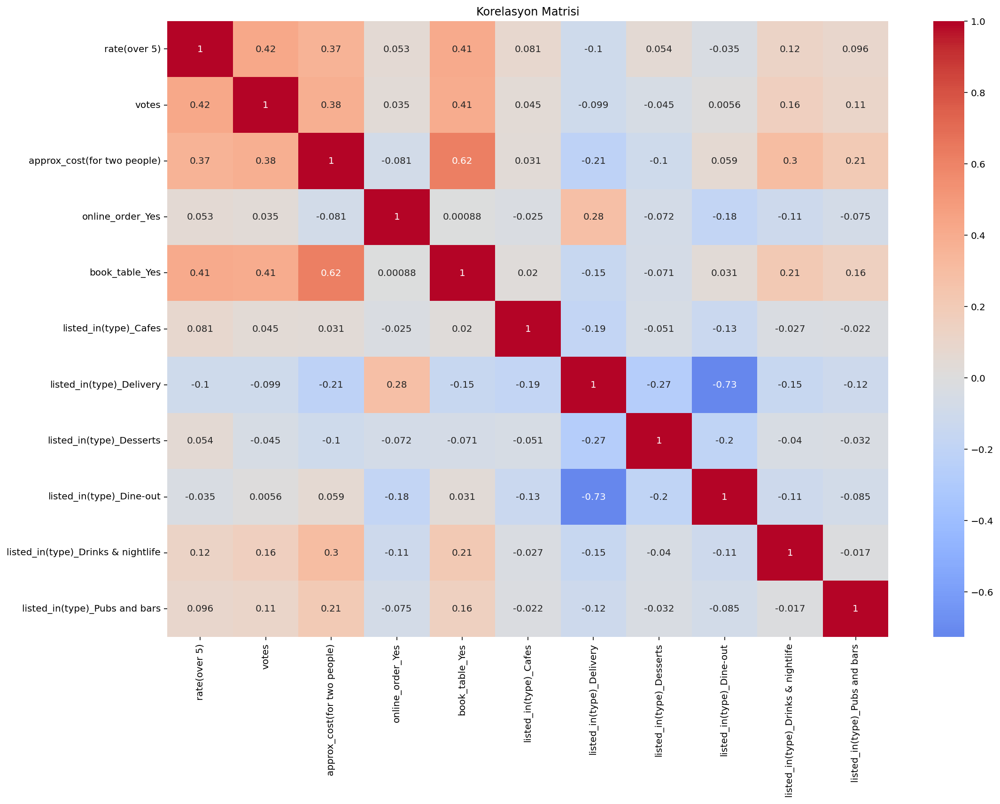
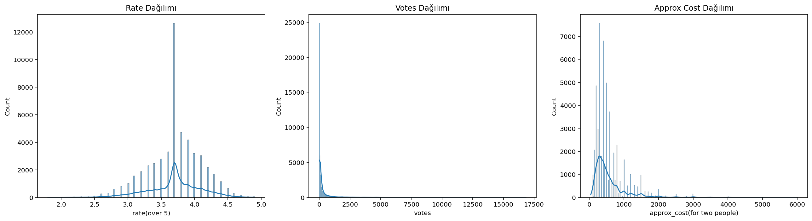
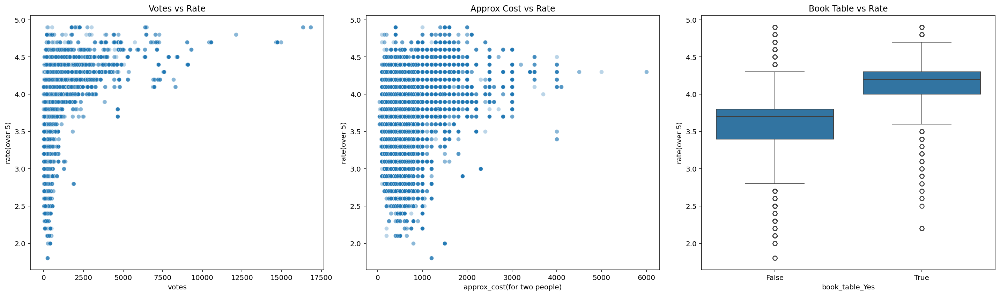
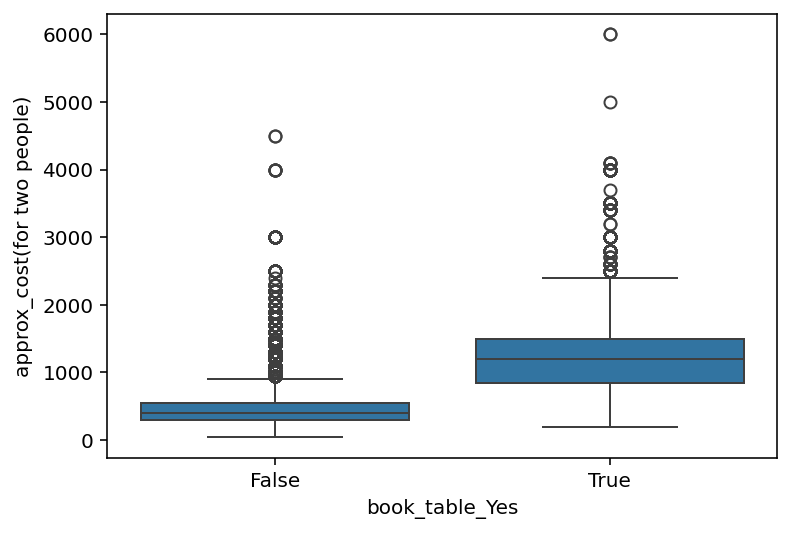

**EN** | [TR](README.tr.md)

# Zomato Bangalore Restaurants — EDA & Feature Engineering

Exploratory data analysis and feature engineering on the Zomato Bangalore Restaurants dataset (51,717 restaurants, 17 columns), covering data cleaning, missing value handling, encoding, and visual analysis of factors related to restaurant ratings.

🔗 **Also available as a Kaggle Notebook:** [zomato-bangalore-restaurants-eda-feature](https://www.kaggle.com/code/nadiucar/zomato-bangalore-restaurants-eda-feature)

## 📊 Dataset

- **Source:** [Zomato Bangalore Restaurants](https://www.kaggle.com/datasets/himanshupoddar/zomato-bangalore-restaurants) (Kaggle)
- **Size:** 51,717 rows × 17 columns
- Restaurant details scraped from Zomato for Bangalore, India — online ordering, table booking, ratings, votes, location, restaurant type, cuisines, approximate cost, reviews, and menu items.

### Dataset Columns

| Column | Description | Note |
|---|---|---|
| `url` | Restaurant's Zomato page URL | |
| `address` | Restaurant's address | |
| `name` | Restaurant name | |
| `online_order` | Whether online ordering is available | Encoded as `online_order_Yes` |
| `book_table` | Whether table reservation is available | Encoded as `book_table_Yes` |
| `rate` | Overall rating out of 5 | Renamed to `rate(over 5)` |
| `votes` | Total number of ratings received | |
| `phone` | Restaurant's phone number(s) | Split into `phone_first` / `phone_secondary` |
| `location` | Neighborhood where the restaurant is located | |
| `rest_type` | Restaurant type (e.g. Casual Dining, Cafe) | |
| `dish_liked` | Dishes customers liked | Dropped — 54% missing |
| `cuisines` | Cuisine styles, comma-separated | |
| `approx_cost(for two people)` | Approximate cost for two people | |
| `reviews_list` | List of (rating, review) tuples | |
| `menu_item` | List of menu items | Dropped — ~76% empty |
| `listed_in(type)` | Service type (Delivery, Dine-out, etc.) | One-hot encoded |
| `listed_in(city)` | Neighborhood the listing is filed under | |

## 🎯 Project Goals

- Clean and standardize a messy, real-world scraped dataset (mixed dtypes, inconsistent formatting, encoding issues)
- Handle missing values with context-aware strategies rather than blanket imputation
- Encode categorical variables for downstream modeling
- Explore relationships between restaurant attributes (cost, votes, table booking) and ratings

## 🧹 Data Cleaning

1. **Rating column (`rate` → `rate(over 5)`)**
   - Replaced placeholder values (`"NEW"`, `"-"`) with `NaN`
   - Removed the `/5` suffix, converted to `float`
   - This raised the missing count from 7,775 to 10,052 — placeholder values like `"NEW"` and `"-"` were hiding additional missing data that a plain `isnull()` check couldn't catch
2. **Phone column**
   - Split into `phone_first` and `phone_secondary` (some restaurants listed two numbers, separated by `\r\n`)
   - Stripped `+` and spaces for a consistent format
3. **Cost column (`approx_cost(for two people)`)**
   - Removed thousands separators (`,`), converted to `float`

## 🕳 Missing Value Handling

| Column | Missing | Strategy |
|---|---|---|
| `rate(over 5)` | 10,052 | Group median by `listed_in(type)` |
| `dish_liked` | 28,078 (54%) | Dropped — too sparse to be reliable |
| `menu_item` | ~76% empty lists (`'[]'`) | Dropped |
| `location` / `cuisines` | 21 / 45 | Rows dropped (negligible share of data) |
| `rest_type` | 227 | Mode imputation (`Quick Bites`, 19,335 occurrences) |
| `approx_cost(for two people)` | 346 | Group median by `listed_in(type)` |
| `phone_first` / `phone_secondary` | 1,179 / 31,661 | Left as-is — structurally missing (most restaurants only list one phone number) |

## 🔢 Encoding

- `online_order`, `book_table` → one-hot encoded (`drop_first=True`)
- `listed_in(type)` → one-hot encoded (`drop_first=True`, reference category: `Buffet`)

## 📈 Exploratory Data Analysis

### Correlation matrix


- `book_table` and `approx_cost` show the strongest relationship (**0.62**) — restaurants that accept table reservations tend to be significantly more expensive.
- `rate` correlates moderately with `votes` (0.42), `book_table` (0.41), and `approx_cost` (0.37).
- Negative correlations among `listed_in(type)_*` dummy columns (e.g. Delivery vs. Dine-out: -0.73) are a structural artifact of one-hot encoding, not a real-world relationship.

### Distributions


- `votes` and `approx_cost` are strongly right-skewed (long-tail distributions).
- `rate(over 5)` shows an artificial spike around **3.7** — traced back to group-median imputation: `Delivery` and `Dine-out` (84% of the dataset) both happen to share a median rating of 3.7, so thousands of imputed values landed on the same point. A methodological artifact, not an organic pattern.

### Rate vs. votes / cost / table booking


- Restaurants with few votes show wide rating variance (1.8 to 4.9); restaurants with many votes converge toward 4.0–4.9 — a classic small-sample variance effect.
- Restaurants that accept table bookings have a visibly higher and tighter rating distribution (median ~4.2) than those that don't (median ~3.7).

### Cost vs. table booking


- Median cost without table booking: **~₹400–450**
- Median cost with table booking: **~₹1,200** (~3x higher), with almost no overlap between the two groups' interquartile ranges.

## 🛠 Tech Stack

- Python — pandas, numpy
- seaborn, matplotlib
- scikit-learn (planned: `MultiLabelBinarizer` for `rest_type` / `cuisines`)

## 📁 Repo Structure

```
zomato-bangalore-eda/
├── README.md
├── requirements.txt
├── notebooks/
│   └── zomato_eda.ipynb
├── scripts/
│   └── zomato_EDA_Featuring_v1.py
└── images/
    ├── zom_corr.png
    ├── zom_hist.png
    ├── zom_box.png
    └── zom_scatterplot_boxplot.png
```

## ▶️ How to Run

```bash
# 1. Download zomato.csv from the Kaggle dataset link above and place it in scripts/
pip install -r requirements.txt
python scripts/zomato_EDA_Featuring_v1.py
```

> The raw dataset (`zomato.csv`) is not included in this repo — see `.gitignore`. Download it from the [Kaggle source](https://www.kaggle.com/datasets/himanshupoddar/zomato-bangalore-restaurants) instead.

## 👤 Author

**Nadi Ucar**
GitHub: [@nadiucar](https://github.com/nadiucar)
